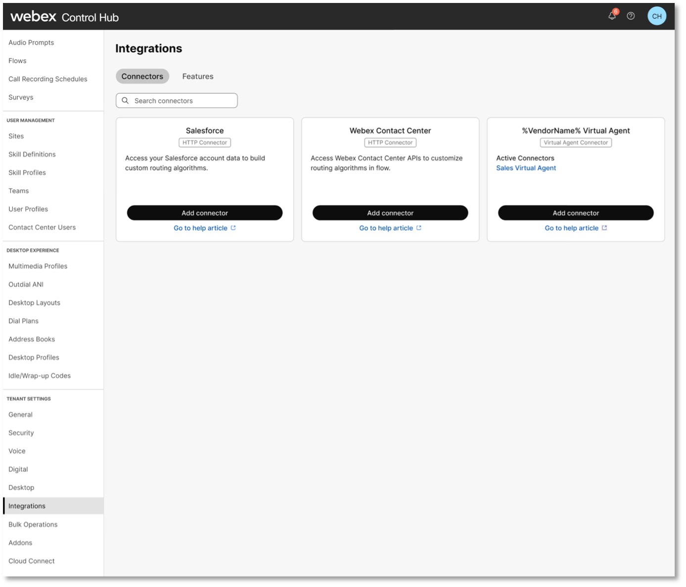
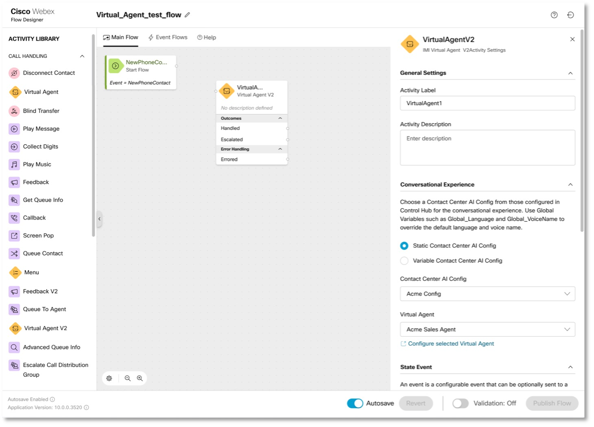

# Bring your own Virtual Agent

The Bring Your Own Virtual Agent Initiative empowers Developers and AI vendors to seamlessly integrate external conversational interface(s) with Webex Contact Center IVR.

## What is a Voice Virtual Agent?

To summarize, the voice virtual agent connects to a caller on a voice call and performs the following actions:
   - Transcribes the caller's **speech to text** for AI processing.
   - Utilizes **Natural Language Understanding** to identify the caller's intent.
   - Maps the identified **intent** to an existing workflow (OR) uses **Generative AI** to create a text response.
   - Converts the generated **text to speech** which is then prompted to the caller back.
   - For escalated calls, provides the human agent with context by supplying the virtual agent's transcript or a summary.
   - Post-call data, including Total Call Handled Time, Call Resolution, Caller Intent, etc. is available in Webex Analyzer.

*Fig 1: A sample virtual agent call that is escalated to a human agent*

## Dialog Connector Simulator
The Dialog Connector Simulator is a sample code that demonstrates how to integrate an external conversational interface with Webex Contact Center IVR.

Refer to the [Dialog Connector Simulator Sample Code](https://github.com/CiscoDevNet/webex-contact-center-ai-sample-code/tree/main/provider-api/dialog-connector-simulator).
For the interface definition see `src/main/proto/com/cisco/wcc/ccai/v1/ccai-api.proto`.

### Onboarding Steps for Using the Dialog Connector Simulator

*Fig 2: Architectural Diagram for provisioning a Virtual Agent*

To use the Dialog Connector Simulator, follow these onboarding steps:

1. **Integration Setup**:
    - Use the Webex Contact Center Control Hub to create an integration **Control Hub -> Contact Center -> Integrations**
    - **Link to integrations** https://admin.webex.com/wxcc/integrations
    - In the Connector Tab, set up the provider's Connector credentials.
      
   
      *Fig 3: Setup Virtual Agent Connectors on the Webex Admin Portal*
2. **AI Configuration**:
    - In the Features Tab, create a Contact Center AI Configuration. This configuration is represented by a `configId` and defines the credentials and features to be used.
      
   
      *Fig 4: Setup a Contact Center AI Configuration entity that connects Webex CC with the external AI service platform*
   
3. **Flow Creation**:
    - Create a flow with the Virtual Agent Voice Activity and use the above created AI Configuration in the Flow Control UI.
      
      
   *Fig 5: Use the “Virtual Agent Activity” in the flow designer to select the virtual agent and configure the routing logic of your workflow.*
4. **EntryPoint Mapping**:
    - Map the EntryPoint to the newly created flow (EntryPoint -> Routing Strategy -> Flow).

After these steps, the Webex Contact Center (WxCC) will orchestrate the call to a specific provider based on the configuration details.

### Prerequisites for Setting Up the Connector

#### Audio Configuration
- Audio Format Supported: _**wav**_
- Audio Sampling Rate: _**16kHz/8KHz**_
- Language: _**en-US**_
- Encoding Format: _**Linear16/ulaw**_
- Please note, we only support wav or raw audio files, 8/16kHz bit rate, single channel

#### Authentication (Coming Soon)
Details about this section will be provided in a future update.

#### List Bot API for Dialog Connector Simulator (Optional)
Each Provider endpoint is recommended to implement an API to return a list of configured bots to be used in
Flow builder to decide the bot to be used during the call flow with the Customer.
The API should return the list of bots configured in the system.
Refer to the ListVirtualAgents API in the ccai-api.proto file.

#### Serviceability
Each Provider endpoint should expose APIs to monitor the health of the endpoint. The APIs should return the status of the service.
Refer to the Check API in the health.proto file.

## Dialog Connector Application Development
### Code Overview
This sample code offers an overview of the various methods and messages used when the Dialog Connector interacts with
the Webex CC VA Client Application.

Here,the Dialog Connector represents a **gRPC Server Application**(see `src/main/java/com/cisco/wccai/grpc/server/GrpcServer.java`) that listens for incoming requests from the
Webex CC VA Client Application which is a **gRPC Client Application**(see `src/main/java/com/cisco/wccai/grpc/client/ConnectorClientVA.java`).

### Development Environment Commands
1. Install Java 17.
Verify the Installation by opening a new terminal and run:

    `java -version`
2. Compile Protobuf Definitions: This will generate java classes under target/generated-sources/protobuf/grpc-java and target/generated-sources/protobuf/java.
    
    `cd webex-contact-center-ai-sample-code/provider-api/dialog-connector-simulator`

    `mvn clean compile`
3. Build the Main Application:

   `mvn clean install`

### Detailed Flow with Sequence Diagram
#### Step 1. Start of Conversation
1. The Dialog Connector will start up as a **gRPC Server Application** (`run GrpcServer.java`).
2. The Webex CC Virtual Agent (VA) Client Application will start up as a **gRPC Client**(`run ConnectorClientVA.java`) and open a secure gRPC connection with the Server Application.
3. When a caller calls, the Client Application signals to the Dialog Connector to start the conversation by creating a new conversation (`conversation_id`) and sending a `StreamingAnalyzeContentRequest` to the Server Application with `EventType: CALL_START`. The `conversation_id` is used for the entire conversation between the Caller (Webex CC VA Client Application) and Virtual Agent (Server Application). The request is sent without any audio data.
4. `EventType: CALL_START` can be used by the connector to start the session with its AI Service and return a response back to the Client using `StreamingAnalyzeContentResponse`. It could contain response payloads, prompts, NLU data, and input mode for handling the next interactions from the Caller. Prompts contain the audio which needs to be played to the Caller. It can return one or multiple prompts in a response. Prompts are played one after another at the client side in the sequence of receiving.

   

#### Step 2. Continue the Conversation Between the Caller and Virtual Agent
1. The Client Application, on receiving the prompt, plays it to the Caller and invokes the next dialog based on the input mode received in the response.
2. **Input Mode** indicates the type of input expected from the Caller. It can be `dtmf` only, `voice` only, or `dtmf_and_voice` both.
    - If the input mode is `dtmf`, the Client Application will wait for the DTMF input from the Caller.
    - If the input mode is `voice`, the Client Application will wait for the voice input from the Caller.
    - If the input mode is `dtmf_and_voice`, the Client Application will start streaming voice input from the Caller.
3. On detecting voice, the Server sends a `StreamingRecognitionResult.EVENT_START_OF_INPUT` to the Client Application to indicate that the Caller is providing voice input and to stop playing the prompt.
4. Once the Caller finishes speaking, the Server detects silence and sends a `StreamingRecognitionResult.EVENT_END_OF_INPUT` to the Client Application to indicate that the Caller has finished speaking.
5. The Server processes the Caller's request and then sends back a `StreamingAnalyzeContentResponse.VirtualAgentResult` to the Client Application with a new set of prompts, NLU data, and input mode for handling the next interactions.

   

#### Step 3. Stop the Conversation
1. When the conversation ends between the Caller and Virtual Agent, the Caller can disconnect the call.
    - The Client Application sends a `StreamingAnalyzeContentRequest` to the Server Application with `EventType: CALL_END`.
    - `EventType: CALL_END` can be used by the Server Application to close the session with its AI Service and return a response back to the Client using `StreamingAnalyzeContentResponse`.
2. Similarly, the Virtual Agent can disconnect the call as well using any of the below Exit events as part of `StreamingAnalyzeContentResponse`.
    - **Call End Event**: Sent when the Server Application wants to disconnect the call from the Virtual Agent side.
    - **Agent Transfer Event**: Sent when the Virtual Agent wants to transfer the call to a human agent.
    - **Custom Event**: Sent when the Virtual Agent wants to return control to the calling application flow. It can pass metadata which will contain the context needed for the Client flow.
3. The conversation is complete.
4. The Server Application can close the gRPC connection with the Client Application.

   

# Glossary
* **Prompts**: The API response will provide the barge-in status of the prompts to be played. Each prompt will indicate if it is barge-in enabled or disabled. The first barge-in enabled prompt in the sequence will make all subsequent prompts barge-in enabled. The Client will play the non-barge-in prompts independently.
* **Prompt Duration**: The Client will also need to set the total duration of barge-in enabled prompts so that the recognizer can wait for this duration.
* **START_OF_SPEECH**: The Client will send the START_OF_SPEECH event to the Server when the user utters a first utterance.
* **Barge-In**: When the Client receives the START_OF_SPEECH event, it will act as an indicator for the Client to barge-in the prompt and continue streaming.
* **Timeout**:  The recognizer will wait for user input based on the timer configured after the prompt finishes. If the user does not provide any input in this duration, the input will time out, resulting in a no-input event.
* **END_OF_SPEECH**: If the user has finished speaking and has taken a pause or has entered all the digits, the Client will receive the END_OF_SPEECH event, indicating to the Client to stop streaming.

