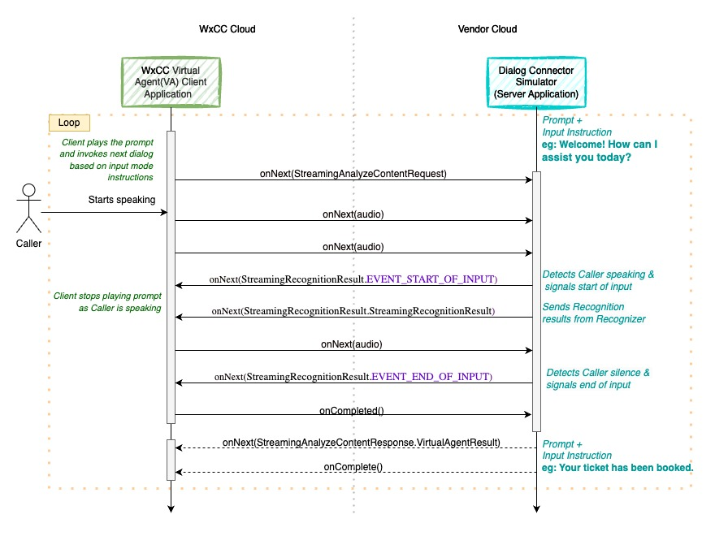
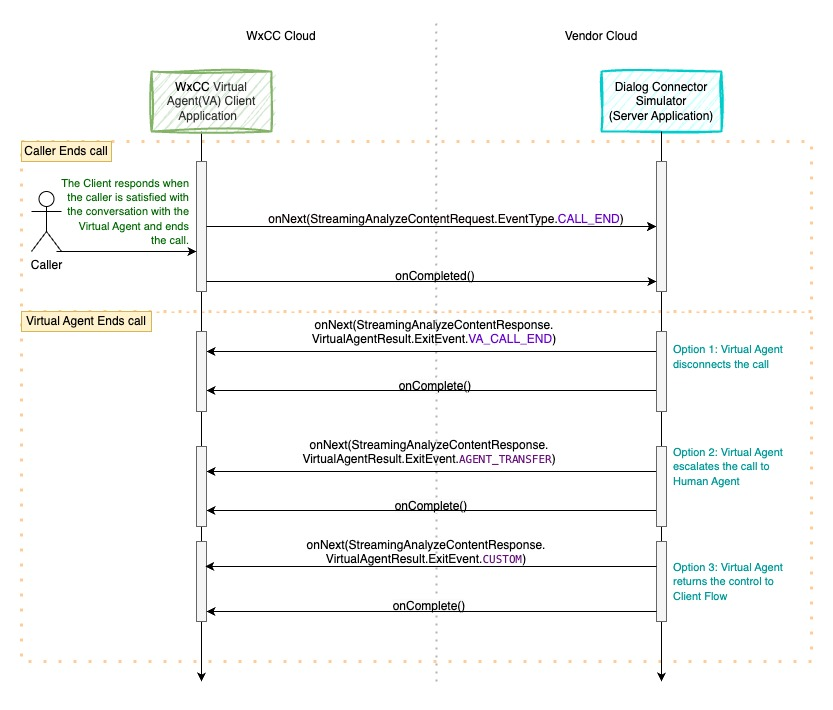

# Dialog Connector Simulator
The Dialog Connector simulator emulates a dialog connector, enabling end-to-end IVR capabilities. Its functionalities include:
* Media Relay
  * Receiving: Accepts media from the WxCC Virtual Agent (VA) Client Application.
  * Forwarding: Relays received media to an External AI Provider for processing.
  * Returning: Transmits processed media back to the WxCC VA Client Application.

* Service Utilization 
  * Based on configuration, it can employ one or multiple service connectors, such as:
    * Text to Speech
    * Speech to Text
    * NLU

These connectors provide comprehensive dialog services.

Onboarding is required to use the Dialog Connector Simulator. The Webex Contact Center Control Hub is used to create a configuration. The configuration includes the provider endpoint, services, and authentication token. The configuration is represented by a configId and defines the services and features to be used. The Orchestrator orchestrates the call to a specific provider and adds the necessary feature flags based on the configuration details.

##  Dialog Connector Code Overview
This sample code offers an overview of the various methods and messages used when the Dialog Connector interacts with 
the WxCC VA Client Application.

Here,the Dialog Connector represents a **gRPC Server Application** that listens for incoming requests from the 
WxCC VA Client Application which is a **gRPC Client Application**.

## Prerequisites for setting up the Connector

### Audio Configuration 
- Audio Format Supported: _**wav**_
- Audio Sampling Rate: _**16kHz/8KHz**_
- Language: _**en-US**_
- Encoding Format: _**Linear16/ulaw**_

### List Bot API for Dialog Connector Simulator
Each Provider endpoint to implement API to return a list of configured bots to be used in Flowbuilder to decide th bot to be used
during the call flow with the Customer. The API should return the list of bots configured in the system.  
Refer ListVirtualAgents API in the ccai-api.proto file.

### Serviceability
Each Provider endpoint to expose certain APIs to monitor the health of endpoint.
https://<Service endpoint>/<service Name>/v1/ping
Please note, we only support wav or raw audio files, 8/16kHz bit rate, single channel

## Dialog Connector Application Development

### Step 1. Start of Conversation
1. Dialog Connector  will start up as gRPC Server Application.
2. WxCC Virtual Agent(VA) Client Application will start up as gRPC client and open a gRPC connection with the above Server Application
3. When a caller calls, the Client application signals to Dialog Connector to start the conversation 
by creating a new conversation (conversation_id) and sending a StreamingAnalyzeContentRequest to the Server Application with EventType:CALL_START.
The conversation_id is used for the entire conversation between the Caller(WxCC Virtual Agent Client Application) and Virtual Agent(Server Application).
The request is sent without any audio data.
4. EventType:CALL_START can be used by the connector to start the session with its AI Service and return response back to the Client using StreamingAnalyzeContentResponse.
It could contain response payloads, prompts, NLU data and input mode for handling next interactions from Caller. 
Prompts contain the Audio which needs to be played to caller. It can return one or multiple prompts in a response. Prompts are played one after another at client side in sequence of receiving.

### Step 2. Continue the Conversation between the Caller and Virtual Agent
1. The client application on receiving the prompt plays it to the Caller and invokes the next dialog based on the input mode received in the response.
2. Input Mode indicates the type of input expected from Caller. It can be dtmf only, voice only or dtmf_and_voice both.
   1. If the input mode is dtmf, the client application will wait for the DTMF input from the Caller.
   2. If the input mode is voice, the client application will wait for the voice input from the Caller.
   3. If the input mode is dtmf_and_voice, the client application will start streaming voice input from the Caller.
3. On detecting voice, Server sends a StreamingRecognitionResult.EVENT_START_OF_INPUT to the Client Application to indicate that the Caller is providing voice input and to therefore stop playing the prompt.
4. Once the caller finishes speaking, the Server detects silence and sends a StreamingRecognitionResult.EVENT_END_OF_INPUT to the Client Application to indicate that the Caller has finished speaking.
5. The Server processes Caller request and then sends back StreamingAnalyzeContentResponse.VirtualAgentResult to the Client Application with a next set of prompts, NLU data and input mode for handling next interactions.

### Step 3. Stop the Conversation
1. When the conversation ends between the Caller and Virtual Agent, the Caller can disconnect the call.
   1. The Client application therefore sends a StreamingAnalyzeContentRequest to the Server Application with EventType:CALL_END.
   2. EventType:CALL_END can be used by the Server Application to close the session with its AI Service and return response back
   to the Client using StreamingAnalyzeContentResponse.
2. Similarly, the Virtual Agent can disconnect the call as well using any of below Exit events as part of StreamingAnalyzeContentResponse.
   1. Call End Event: Sent when the Server Application want to disconnect the call from the Virtual Agent side. 
   2. Agent Transfer Event: Sent when Virtual Agent Wants to Transfer the call to the Human Agent 
   3. Custom Event: Sent when Virtual Agent wants to return the control to the calling application flow. Can pass the 
   metadata which will contain the context which needs to be passed to Client flow.
3. The conversation is complete.
4. The Server Application can close the gRPC connection with the Client application.

### Overall flow of the Agent Assist mode
Agent Assist Services leverages the AI services and helps agent handle the customer in more effective way.

# Glossary
  * **Prompts**: The API response will provide the barge-in status of the prompts to be played. Each prompt will indicate if its barge-in enabled / disabled.
  * First Barge-in enabled prompt in the sequence of prompt will make all subsequent prompts barge-in enabled.
  * Client will play the non-barge-in prompts independently.
  * **Prompt Duration**: Client will also need to set the total duration of barge-in enabled prompts so that recognizer can be made waiting for this much long duration.
  * **START_OF_SPEECH**: Client will send the START_OF_SPEECH event to server when user utters a first utterance.
  * **Barge-In**: When client receives START_OF_SPEECH event, it will act as indicator for client to barge-in the prompt and continue the streaming.
  * **Timeout**: Recognizer will wait for user input based on the timer configured after the prompt finish, if user does not provide any input in this duration, the input will time out resulting a no-input event.
  * **END_OF_SPEECH**: If user has finished speaking and has taken a pause or has entered all the digits, client will receive END_OF_SPEECH event which indicates to the client to stop streaming.

